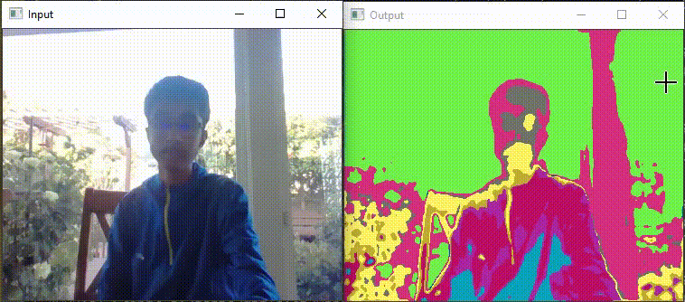

# Unsupervised Image Segmentation

Implemented a varation of "Unsupervised Learning of Image Segmentation Based on Differentiable Feature Clustering" by Wonjik Kim, Asako Kanezaki, and Masayuki Tanaka ([arXiv](https://arxiv.org/abs/2007.09990)). Rather than training on a single image, this algorithm trains on an image dataset.

## Requirements
pytorch, opencv2, numpy, pandas, matplotlib, scikit-image

## Getting started
If you want to train your own model, choose an image dataset, put the images in a folder. Then, go to `config.py` and change im_folder to the name of the folder. Finally, run the cells in `train.ipynb`. It will create a .pt file, its name being the name of the folder. 

To test the algorithm with a live camera, rename im_folder in `config.py` to the name of the model you want, and run `python live_segmentation.py`. Click esc to stop.